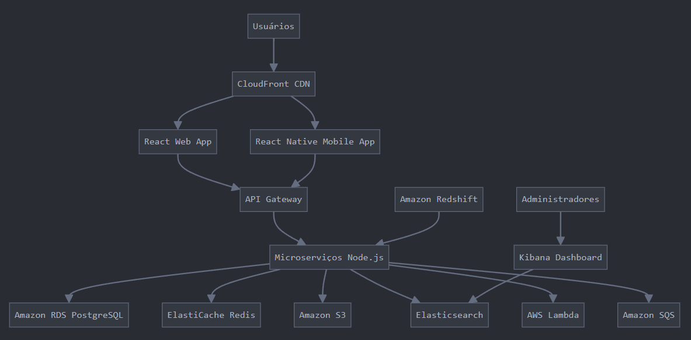

# Arquitetura de Software para Clone do Pinterest

## Introdução

Este documento apresenta uma proposta de arquitetura de software para criar um sistema similar ao Pinterest, focado inicialmente no mercado brasileiro, com uma base de aproximadamente 100 mil usuários. A arquitetura foi projetada considerando os seguintes casos de uso principais:

- Gerenciamento de diferentes formatos de mídia (imagens, vídeos, links) e origens (criado por usuário, gerado pela plataforma, ADs, conteúdo externo)
- Recomendação de conteúdos relevantes para o usuário
- Funcionalidades de salvar conteúdo em pastas, curtir e comentar

## Visão Geral da Arquitetura

## Infraestrutura

- **Cloud**: AWS (Amazon Web Services)
- **Região**: São Paulo (sa-east-1)

**Justificativa**: A AWS oferece uma gama completa de serviços necessários, com boa presença e suporte no Brasil. A região de São Paulo minimiza a latência para usuários brasileiros.

## Componentes da Arquitetura

### 1. Front-end

- **Web**: React.js
- **Mobile**: React Native

**Justificativa**: React permite compartilhar lógica entre web e mobile, acelerando o desenvolvimento e manutenção.

### 2. Back-end

- **API**: Node.js com Express.js
- **Arquitetura**: Microserviços

**Justificativa**: Node.js oferece boa performance para operações I/O intensivas. Microserviços permitem escalabilidade e manutenção independente.

### 3. Banco de Dados

- **Principal**: Amazon RDS (PostgreSQL)
- **Cache**: Amazon ElastiCache (Redis)

**Justificativa**: PostgreSQL para dados estruturados, Redis para cache e sessões.

### 4. Armazenamento de Mídia

- Amazon S3

**Justificativa**: Escalável, durável e integrado com CDN para entrega rápida de conteúdo.

### 5. Busca e Recomendação

- Amazon Elasticsearch Service

**Justificativa**: Poderoso para buscas complexas e recomendações baseadas em conteúdo.

### 6. Processamento de Mídia

- AWS Lambda

**Justificativa**: Serverless para processamento assíncrono de imagens e vídeos.

### 7. CDN

- Amazon CloudFront

**Justificativa**: Entrega rápida de conteúdo estático e mídia.

### 8. Fila de Mensagens

- Amazon SQS

**Justificativa**: Desacopla serviços e gerencia carga de trabalho assíncrona.

### 9. Análise de Dados

- Amazon Redshift

**Justificativa**: Data warehouse para análises complexas e geração de insights.

## Fluxos Principais

### 1. Gerenciamento de Mídia

1. Usuários fazem upload de mídia através da aplicação web/mobile.
2. API Gateway roteia para o microserviço apropriado.
3. Microserviço salva metadados no RDS e mídia no S3.
4. Lambda processa a mídia (redimensionamento, compressão, etc.).
5. Elasticsearch indexa os metadados para busca rápida.

### 2. Recomendação de Conteúdo

1. Baseado em interações do usuário (salvos, curtidas, visualizações).
2. Elasticsearch utiliza estes dados para gerar recomendações personalizadas.
3. Microserviço de recomendação consulta Elasticsearch e retorna resultados.

### 3. Interações do Usuário

1. Ações de salvar, curtir, comentar são processadas pelos microserviços.
2. Dados são armazenados no RDS.
3. Atualizações em tempo real via WebSockets para notificações.

### 4. Conteúdo Externo

1. Links externos são processados, metadados extraídos e armazenados.
2. Thumbnail gerado e armazenado no S3 para preview.

### 5. Análise de Dados

1. Logs e eventos são enviados para o Amazon Redshift.
2. Dashboards em Kibana para visualização de métricas e tendências.

## Considerações Finais

Esta arquitetura oferece escalabilidade, resiliência e performance para atender os 100 mil usuários iniciais, com capacidade de crescimento. A escolha de serviços gerenciados da AWS reduz a complexidade operacional, permitindo foco no desenvolvimento de features.

### Evolução Futura

Para evolução futura, considerar:

- Implementar AWS WAF para segurança adicional.
- Utilizar Amazon Personalize para recomendações mais avançadas.
- Explorar Amazon Rekognition para análise de imagens e moderação de conteúdo.

Esta proposta equilibra custos iniciais com potencial de escala, adequada para o mercado brasileiro e expansível para outros países de língua portuguesa.
